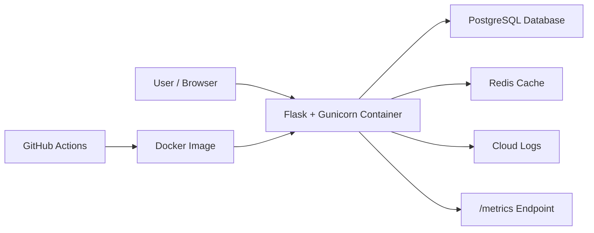

# Car Rental Cloud - Proje Raporu

## 1. Proje Bilgileri

- **Ders:** Cloud Computing
- **Proje konusu:** Car Rental System
- **Takım:** Solo
- **Öğrenci:** Ad Soyad / Öğrenci No
- **Teslim tarihi:** 22 Mayıs 2026
- **GitHub repository:** Repository linki buraya eklenecek
- **Demo video:** Video linki buraya eklenecek

## 2. Özet

Bu projede araç kiralama operasyonlarını yöneten, 12-factor prensiplerine
uygun, container tabanlı ve cloud ortamına deploy edilebilir bir web uygulaması
geliştirilmiştir. Sistem araç envanteri, müşteri kaydı, rezervasyon oluşturma,
rezervasyon çakışması kontrolü, araç iadesi, health check, readiness check,
metrik ve JSON loglama özelliklerini içerir.

## 3. Problem Tanımı

Araç kiralama firmaları araç durumlarını, müşteri bilgilerini ve aktif
kiralama kontratlarını güvenilir biçimde takip etmelidir. Manuel takip
süreçleri aynı aracın aynı tarih aralığında birden fazla müşteriye
kiralanmasına, operasyonel gecikmelere ve raporlama eksiklerine yol açabilir.
Bu proje, bu problemi cloud-native bir servis olarak çözmeyi hedefler.

## 4. Amaçlar

- Araç ekleme ve araç durum yönetimi
- Müşteri kaydı oluşturma
- Kiralama oluşturma ve tarih çakışmasını engelleme
- Kiralama iadesi ile aracı tekrar kullanılabilir yapma
- Cloud üzerinde çalışabilecek 12-factor uyumlu mimari
- CI/CD ile test ve Docker image build süreci
- Health, readiness, metrics ve stdout loglama

## 5. Teknoloji Seçimi

| Bileşen | Seçilen teknoloji |
| --- | --- |
| Dil / Framework | Python 3.12, Flask |
| Veritabanı | PostgreSQL, lokal geliştirmede SQLite |
| Cache | Redis |
| Deployment | Docker, Google Cloud Run örnek manifesti |
| CI/CD | GitHub Actions |
| Monitoring | Health endpoints, readiness endpoint, Prometheus-style metrics |
| Logging | JSON logs to stdout |

## 6. Sistem Mimarisi

Uygulama stateless bir HTTP servisi olarak tasarlanmıştır. Flask/Gunicorn
uygulaması gelen HTTP isteklerini işler. Kalıcı veriler PostgreSQL veritabanında
tutulur. Redis, araç listeleme gibi sık kullanılan okumalar için opsiyonel cache
katmanı olarak kullanılır. Cloud ortamında loglar stdout üzerinden platformun
loglama sistemine aktarılır.

## 7. Veri Modeli

Sistemde üç ana tablo bulunur:

- **Car:** Plaka, marka, model, yıl, lokasyon, günlük ücret ve durum bilgisi
- **Customer:** Ad soyad, e-posta ve telefon bilgisi
- **Rental:** Araç, müşteri, başlangıç tarihi, bitiş tarihi, toplam ücret ve durum

Kiralama oluşturulurken aynı araç için aktif ve tarih aralığı çakışan başka bir
kiralama olup olmadığı kontrol edilir.

## 8. API Tasarımı

| Metot | Endpoint | Açıklama |
| --- | --- | --- |
| GET | `/healthz` | Servis sağlık kontrolü |
| GET | `/readyz` | Veritabanı/cache erişilebilirlik kontrolü |
| GET | `/metrics` | Prometheus formatında metrikler |
| GET | `/api/cars` | Araç listesi |
| POST | `/api/cars` | Araç ekleme |
| PATCH | `/api/cars/{id}/status` | Araç durum güncelleme |
| GET | `/api/customers` | Müşteri listesi |
| POST | `/api/customers` | Müşteri ekleme |
| GET | `/api/rentals` | Kiralama listesi |
| POST | `/api/rentals` | Kiralama oluşturma |
| POST | `/api/rentals/{id}/return` | Araç iadesi |

## 9. 12-Factor Uygunluğu

| 12-Factor maddesi | Projede karşılığı |
| --- | --- |
| Codebase | Tek GitHub repository |
| Dependencies | `requirements.txt` ile açık bağımlılık yönetimi |
| Config | `DATABASE_URL`, `REDIS_URL`, `SECRET_KEY` gibi env değişkenleri |
| Backing services | PostgreSQL ve Redis URL ile bağlanır |
| Build, release, run | Docker image build ve cloud run aşamaları ayrıdır |
| Processes | Uygulama stateless HTTP process olarak çalışır |
| Port binding | `$PORT` üzerinden dış dünyaya açılır |
| Concurrency | Gunicorn worker/thread ayarları env ile değiştirilebilir |
| Disposability | Healthcheck ve hızlı container başlatma desteklenir |
| Dev/prod parity | Aynı container lokal ve cloud ortamında çalışır |
| Logs | JSON loglar stdout'a yazılır |
| Admin processes | Seed ve tablo oluşturma env değişkenleri ile yönetilir |

## 10. CI/CD Süreci

GitHub Actions pipeline iki işten oluşur:

1. Python bağımlılıklarını kurar ve `pytest` testlerini çalıştırır.
2. Testler başarılı olursa Docker image build adımını çalıştırır.

Bu yapı, GitHub repository'ye push veya pull request geldiğinde otomatik olarak
çalışacak şekilde ayarlanmıştır.

## 11. Cloud Deployment Planı

Önerilen cloud deployment:

- Uygulama container image olarak Artifact Registry veya benzeri bir registry'ye
  gönderilir.
- Cloud Run üzerinde stateless servis olarak çalıştırılır.
- PostgreSQL için Cloud SQL kullanılır.
- Redis için Memorystore veya managed Redis kullanılır.
- Health check `/healthz`, readiness check `/readyz`, metrikler `/metrics`
  endpointinden alınır.
- Loglar stdout üzerinden cloud logging sistemine akar.

Detaylı komutlar `docs/deployment-google-cloud.md` dosyasındadır.

## 12. Testler

Testlerde aşağıdaki senaryolar doğrulanır:

- Health endpoint çalışıyor.
- Metrics endpoint Prometheus formatında cevap veriyor.
- Araç ve müşteri oluşturulabiliyor.
- Kiralama oluşturulurken toplam fiyat doğru hesaplanıyor.
- Aynı araç için tarih çakışması engelleniyor.
- Kiralama iadesi sonrası status `completed` oluyor.
- Validasyon hataları JSON formatında dönüyor.

## 13. Sonuç

Car Rental Cloud, küçük ölçekli bir araç kiralama operasyonunu cloud-native
yaklaşımla modelleyen, 12-factor prensipleriyle uyumlu, Docker ve CI/CD destekli
bir uygulamadır. Proje; uygulama geliştirme, cloud deployment, monitoring,
logging ve otomatik test süreçlerini tek repository içinde göstermektedir.

## 14. Ekran Görüntüleri

Bu bölüme demo sırasında alınacak ekran görüntüleri eklenecektir:

- Dashboard ana ekranı
- Araç ekleme
- Müşteri ekleme
- Kiralama oluşturma
- `/metrics` çıktısı
- GitHub Actions başarılı pipeline görüntüsü

